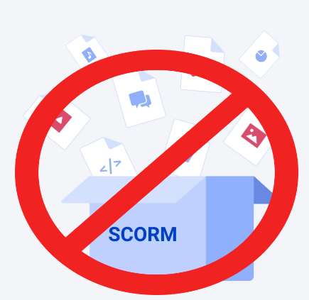

# AntiScorm

Este projeto consiste de uma automação para as atividades SCORMs 
do IFMG Campus Betim. 

O AntiScorm usa o Selenium para automatizar a realização das atividades.

### Features
- Obtenção das informações e cálculo das variáveis
- Conversão automática das unidades
- Salvamento dos printscreens
- Geração de PDF no template requerido

### Requisitos
- Python >= 3.6
- selenium >= 4.3.0
- PyMuPDF >= 1.20.0

### Instalação
O AntiScorm ainda se encontra em desenvolvimento, não tendo sido validado
em atividades SCORM reais.
